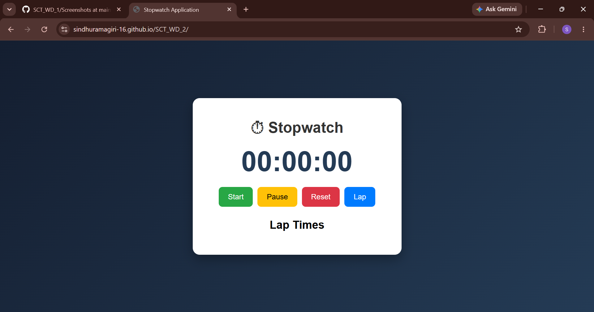
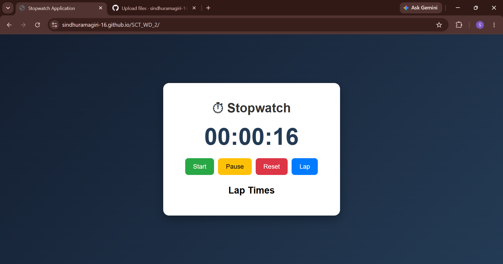
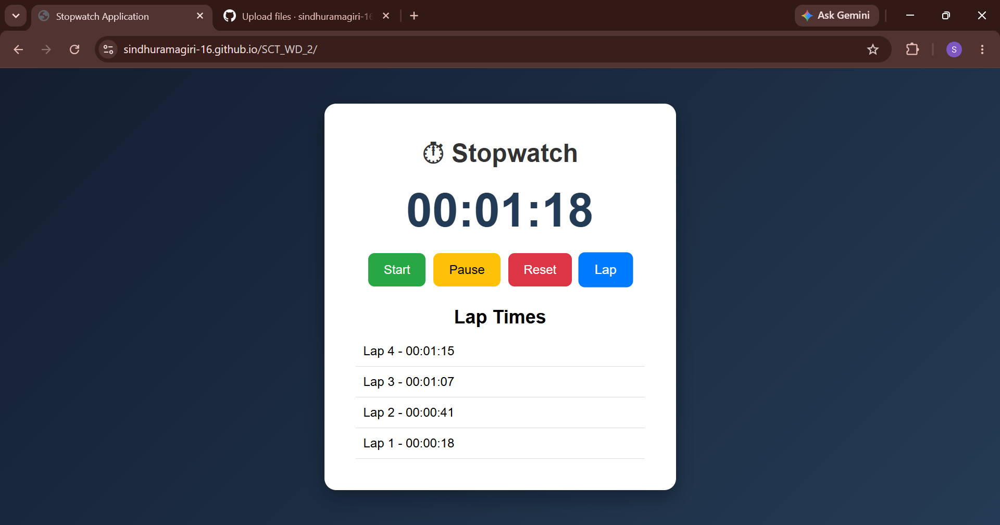

# SCT_WD_2 - Stopwatch Web Application

## 📌 Project Description

This project is an interactive Stopwatch Web Application developed as part of the SkillCraft Technology Web Development Internship Program.

The application enables users to measure time intervals accurately with features such as start, pause, reset, and lap time tracking.

---

## 🚀 Features

- Start Stopwatch
- Pause Stopwatch
- Reset Stopwatch
- Record Lap Times
- Display Lap History
- Responsive User Interface

---

## 🛠 Technologies Used

- HTML5
- CSS3
- JavaScript

---

## 📂 Project Structure

SCT_WD_2/
│
├── index.html
├── style.css
├── script.js
├── README.md
└── screenshots/
    ├── home.png
    ├── running.png
    └── lap-times.png

---

## ▶ How to Run

1. Download or Clone the Repository.
2. Open the project folder in VS Code.
3. Open index.html using a browser or Live Server.
4. Use the stopwatch controls.

---

## 📸 Screenshots

### Home Screen

### Stopwatch Running

### Lap Time Tracking

---

## 🎯 Learning Outcomes

- DOM Manipulation
- Event Handling
- JavaScript Timing Functions
- Responsive Web Design
- Git & GitHub Workflow

---

